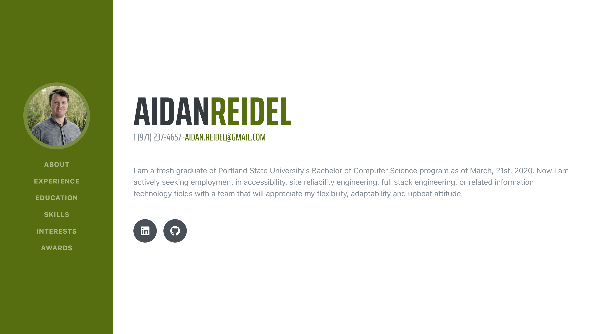

# Portfolio
## Built using React and Deployed with GitHub Actions

The hosted version of this repository is live at [https://aidanreidel.com](https://aidanreidel.com)

## Steps to run locally
1. Clone the repository using `git clone git@github.com:aidanreidel/GitHub-Education-Portfolio.git`
2. `cd` into the cloned repository and run `yarn`. This will install all the dependencies required for the project.
3. Run the server using `yarn start`.

## Acknowledgments 
This project was developed from a tutorial by [Anupam Dagar.](https://github.com/Anupam-dagar/GitHub-Education-Portfolio) The [medium post](https://levelup.gitconnected.com/create-a-portfolio-using-react-and-github-student-developer-pack-955379207855) where I found this tutorial.

Deployed to Github pages with [Deploy to GitHub Pages](https://github.com/marketplace/actions/deploy-to-github-pages).
This project was bootstrapped with [Create React App](https://github.com/facebook/create-react-app).
The Bootstrap template used is [startbootstrap-resume](https://github.com/BlackrockDigital/startbootstrap-resume).